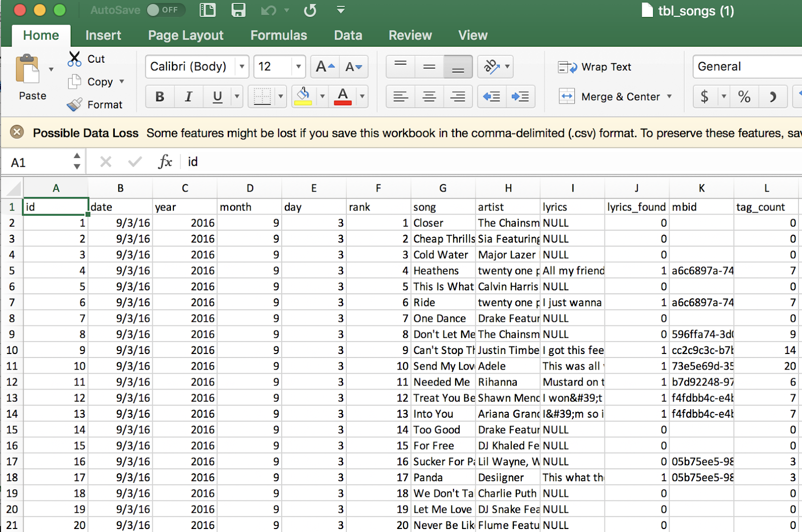

FOR ENTERTAINMENT PURPOSES ONLY - Not a scientific publication

## THE 80's: The 'Greatest' Decade of Music in Human History

**PROPOSAL**

The purpose of this research is to use the R programming langauge and tools to analyze and visualize gathered data to prove that the 80's was the "greatest" decade of music in human history. For the purposes of this experiment, “greatest” will be measured as:
  
- More prolific
- More variety
- Better quality

“More prolific” would be measured as the number of different artists publishing different songs, “more variety” would be measured as the number of different genres, and “better quality” would be measured as the complexity of the musical composition and/or reading level of the lyrics.	

**DATA COLLECTION**

The base dataset is all of Billboard magazine’s ‘Hot 100’ (www.billboard.com), a list of the top 100 songs of the week going back to January of 1970.  The lyrics will be extracted from lyrics.wikia.com.  The genres will be derived from the beta tagging system at musicbrainz.org.  The reading level and/or sophistication of the lyrics will be calculated by www.readabilityformulas.com.  All data is stored in a MySQL database, organized via SQL and exported to CSV files.  The CSV files will be read into R.

**Sample Song Data**

_Song data collection methods have been hidden_

Because there was no public API I had to try and programatically create URLs from the song data. This turned out to be difficult because the artist and song titles between billboard.com and lyrics.wikia.com do not always match (http://lyrics.wikia.com/wiki/The_Dream_Syndicate:I_Ain%27t_Living_Long_Like_This, http://lyrics.wikia.com/wiki/Puff_Daddy:P.Diddy).  

However for the purposes of this exercise I decided I did not need 100% of all song lyrics.  After running the scraper, I was able to collect 60% of the songs from 1970 to 1979, but then my scraper failed.  My only conclusions is that my scraper was blocked by the site, so I was not able to complete this part of the project.

As for tags and metadata related to songs, musicbrainz.org had an API that allowed me to extract tags for the artists in the database.  The metadata has a few issues.  First it is in beta and suffers from the fact that categorizing music by genre is completely subjective and therefore not an exact science.  Second the metadata is by artist and not song, so if an artist has a diverse discography that has evolved over time, we would not be able to accurately label the music year to year.

